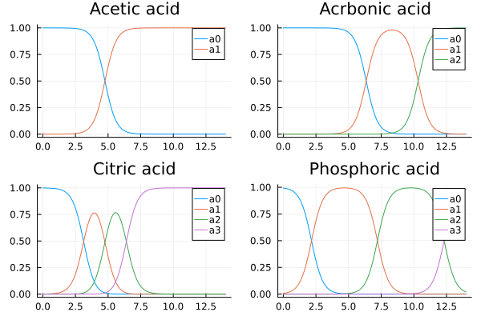

# ChemicalBuffers Theory

The computation is based on the method described in https://www.mdpi.com/2624-8549/3/2/34

This is based on activities 

$$
Ka_i = \{H^+\}\{H_{n-i}A^-\}/\{H_nA\}
$$


Notes: (§1.2)

* The present review follows the first approach: the hydrochemical approach (based on dissociation reactions with reference state HNA)
* it is assumed that the activities (that enter the mass action laws) are replaced by molar concentrations, which is justified either for dilute systems or for non-dilute systems using conditional equilibrium constants 

* Central formula: n = Y1 + w/CT

Overview:

* §2.1: 1-component system
* §2.2: 3 component acid-base system
* §2.3: buffer capacities and intensities
* §2.4: auto proteolysis
* §2.5: perspectivation
* §3: Activities and concentrations?
* §4: zwitterions
* Appendix B: Effective concentrations: {j} = \gamma_j[j]

## Notation

[j] = [H_{N-j}A^j] : Molar concentration of acid specis (2)
C_T = [H_NA]_T = \sum_{j=0}^N [j] (4)
{j} = \gamma_j[j] (5) : activity of acid species j
x = {H^+} = 10^{-pH} (6) : activity of H+
K_w = {H^+}{OH^-} (7)
K_w = 1.0E-14 @ 25C
w(x) = [OH^-] - [H^+] = K_w/x - x/\gama_H (8)
K_a = {H^+}{A^-}/{HA} (10)
^cK_a = {H^+}[A^-]/[HA] (11)
pKa = -ln(Ka) (12)
k_0 = 1
k_j = \Pi_{i = 1}^j K_i = {H^+}^j{H_{N-j}A^{-j}}/{H_N A} (12)
k_j = x^j {j} / {0}
{j} = k_j/x^j {0} \forall j (14) 
C_T = \sum [j] = [0] \sum_{j=0}^N k_j/x^j (15) mass ballance
a_j = [j]/C_T (16): ionization fractions

## Ionization function

We implement equation (17) as function `ionization_fractions_gamma1` and define a plot recipe for BufferComponent using that:

```julia
using ChemicalBuffers
using Plots
plot(plot(acetic_acid), plot(carbonic_acid), plot(citric_acid), plot(phosphoric_acid))
```



# Appendix

A similar approach is described in this answer:
https://chemistry.stackexchange.com/questions/149282/how-to-numerically-model-a-phosphoric-acid-titration-curve/149285#149285 .
An R implementation based on that can be found here: https://github.com/naikymen/titration

It is also the method used in https://www.egr.msu.edu/~scb-group-web/buffers/buffers.html and in the python library pHcalc https://github.com/rnelsonchem/pHcalc.

I have my own implementation of that here: https://github.com/tp2750/pHcalc.jl

There is now even a version in the registry: https://github.com/egonik-unlp/PHcalc.jl

# Cut

https://chemistry.stackexchange.com/questions/149282/how-to-numerically-model-a-phosphoric-acid-titration-curve/149285#149285 .

This works for phosphoric acid and similar buffers, but perhaps not generally?

* Given pH and pKa values, we can compute the relative ratios of the protonation species.
* This implies how much metal ion is needed to get net charge zero.
* Given the total buffer strength, determines the actual concentration of the salts.

Actually, it is the activities, not the pKa values, see https://www.mdpi.com/2624-8549/3/2/34

$$
Ka_i = \{H^+\}\{H_{n-i}A^-\}/\{H_nA\}
$$

Note: We should also apply this to large proteins.

Based on https://www.mdpi.com/2624-8549/3/2/34
